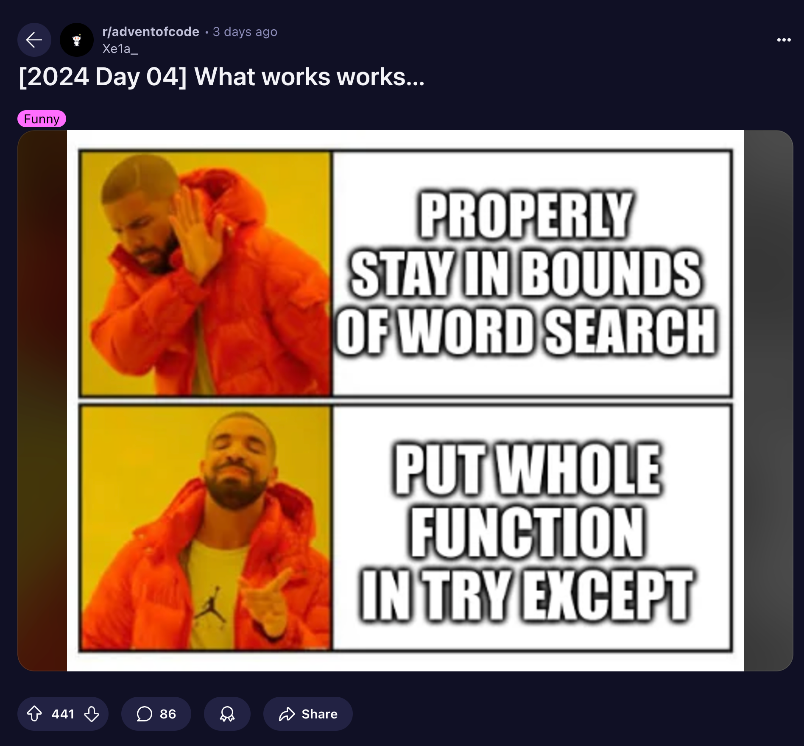
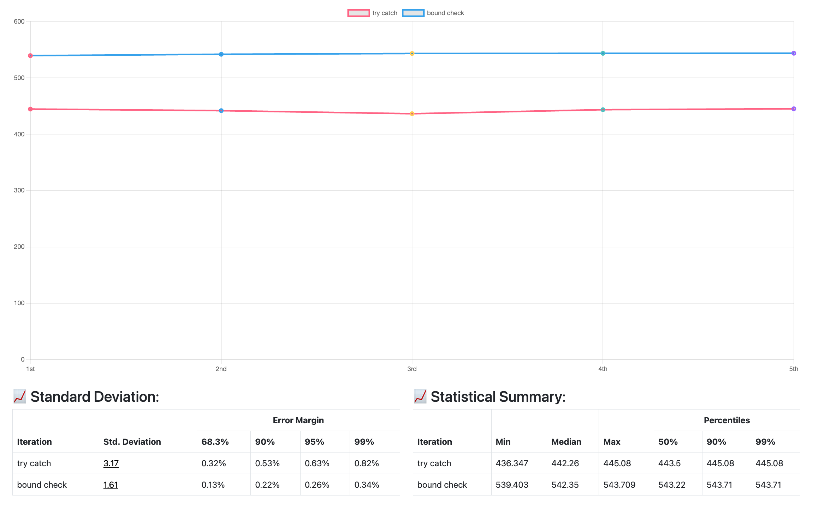

During the [day 4](https://adventofcode.com/2024/day/4) advent of code 2024, I noticed the above meme in Reddit 😄. I got curious about the performance of both approach and thought of benchmarking it

## 👨🏼‍💻 Code

**Full Code: Boundary Check**

```kotlin
enum class Direction(
    val rowVal: Int,
    val colVal: Int
) {
    TOP(-1, 0),
    RIGHT(0,1),
    LEFT(0, -1),
    BOTTOM(1, 0),
    BOTTOM_RIGHT(1,1),
    BOTTOM_LEFT(1, -1),
    TOP_RIGHT(-1,1),
    TOP_LEFT(-1, -1),
}

class Day4 : Puzzle() {
    override fun solve(): Pair<Int, Int> {
        return part1().assertAndReturn(2554) to part2().assertAndReturn(1916)
    }

    private fun part1(): Int {
        val charMatrix = input.lines().map { line ->
            line.toList()
        }

        var count = 0
        for (rowIndex in 0..charMatrix.lastIndex) {
            for (colIndex in 0..charMatrix[rowIndex].lastIndex) {
                val char = charMatrix[rowIndex][colIndex]
                if (char == 'X') {
                    charMatrix.isXmas(rowIndex, colIndex, Direction.TOP).ifTrue { count++ }
                    charMatrix.isXmas(rowIndex, colIndex, Direction.BOTTOM).ifTrue { count++ }
                    charMatrix.isXmas(rowIndex, colIndex, Direction.RIGHT).ifTrue { count++ }
                    charMatrix.isXmas(rowIndex, colIndex, Direction.LEFT).ifTrue { count++ }
                    charMatrix.isXmas(rowIndex, colIndex, Direction.TOP_RIGHT).ifTrue { count++ }
                    charMatrix.isXmas(rowIndex, colIndex, Direction.TOP_LEFT).ifTrue { count++ }
                    charMatrix.isXmas(rowIndex, colIndex, Direction.BOTTOM_RIGHT).ifTrue { count++ }
                    charMatrix.isXmas(rowIndex, colIndex, Direction.BOTTOM_LEFT).ifTrue { count++ }
                }
            }
        }
        return count
    }

    private fun part2(): Int {
        val charMatrix = input.lines().map { line -> line.toList() }
        var count = 0
        for (rowIndex in 0..charMatrix.lastIndex) {
            for (colIndex in 0..charMatrix[rowIndex].lastIndex) {
                val char = charMatrix[rowIndex][colIndex]
                if (char == 'A' &&
                    (rowIndex - 1) >= 0 &&
                    (colIndex - 1) >= 0 &&
                    (rowIndex + 1) <= charMatrix.lastIndex &&
                    (colIndex + 1) <= charMatrix[rowIndex].lastIndex
                ) {
                    val topLeft = charMatrix[rowIndex - 1][colIndex - 1]
                    val topRight = charMatrix[rowIndex - 1][colIndex + 1]
                    val bottomRight = charMatrix[rowIndex + 1][colIndex + 1]
                    val bottomLeft = charMatrix[rowIndex + 1][colIndex - 1]

                    val isGoodLeftDiagonal =
                        (topLeft == 'M' && bottomRight == 'S') || (topLeft == 'S' && bottomRight == 'M')
                    val isGoodRightDiagonal =
                        (topRight == 'M' && bottomLeft == 'S') || (topRight == 'S' && bottomLeft == 'M')

                    if (isGoodRightDiagonal && isGoodLeftDiagonal) {
                        count++
                    }
                }
            }
        }

        return count
    }

    private fun Boolean.ifTrue(onXMAS: () -> Unit) {
        if (this) {
            onXMAS()
        }
    }

    private fun List<List<Char>>.isXmas(rowIndex: Int, colIndex: Int, direction: Direction): Boolean {
        val sb = StringBuilder()
        var rowX = rowIndex
        var colX = colIndex
        repeat(4) {
            if (rowX < 0 || colX < 0 || rowX > this.lastIndex || colX > this[rowX].lastIndex ) return false
            sb.append("${this[rowX][colX]}")
            rowX += direction.rowVal
            colX += direction.colVal
        }
        return sb.toString() == "XMAS"
    }
}
```

**Try-Catch**

To benchmark with try-catch I changed the `isXmas()` to this

```kotlin
private fun List<List<Char>>.isXmas(rowIndex: Int, colIndex: Int, direction: Direction): Boolean {
    ...
    repeat(4) {
        try {
            ...
        } catch (e: IndexOutOfBoundsException) {
            return false
        }
    }
    ...
}
```

and `part2` function to this

```kotlin
private fun part2(): Int {
    ...
    for (rowIndex in 0..charMatrix.lastIndex) {
        for (colIndex in 0..charMatrix[rowIndex].lastIndex) {
            ...
            if (char == 'A') {
                try {
                    ...
                } catch (_: IndexOutOfBoundsException) {
                }
            }
        }
    }
    ...
}
```

You can see the diff in a better way [here](https://github.com/theapache64/aoc-2024/commit/debcfb0f675ccd70e823233cc3db573c80b930ad) in GitHub

## 🤹🏼 Benchmark

For benchmarking, I've used [kotlinx-benchmark](https://github.com/Kotlin/kotlinx-benchmark). The benchmark code looks like this

```kotlin
import kotlinx.benchmark.*

@State(Scope.Benchmark)
class DayBenchmark {
    private final val day = Day4()

    @Setup
    fun prepare() {
        day.input = readInput(day::class.simpleName!!)
    }

    @Benchmark
    fun solution(): Pair<Int, Int> {
        return day.solve()
    }
}
```

## 📜 Result

To run the benchmark I ran `./gradlew benchmark` and here are the result

**Try-Catch**

```
Warm-up 1: 437.972 ops/s
Warm-up 2: 444.304 ops/s
Warm-up 3: 442.620 ops/s
Warm-up 4: 442.364 ops/s
Warm-up 5: 442.061 ops/s
Iteration 1: 444.587 ops/s
Iteration 2: 441.780 ops/s
Iteration 3: 436.347 ops/s
Iteration 4: 443.501 ops/s
Iteration 5: 445.080 ops/s

  Success: 442.259 ±(99.9%) 13.628 ops/s [Average]
  (min, avg, max) = (436.347, 442.259, 445.080), stdev = 3.539
  CI (99.9%): [428.631, 455.887] (assumes normal distribution)


main summary:
Benchmark               Mode  Cnt    Score    Error  Units
DayBenchmark.solution  thrpt    5  442.259 ± 13.628  ops/s
```

**Boundary Check**

```
Warm-up 1: 509.007 ops/s
Warm-up 2: 512.232 ops/s
Warm-up 3: 525.101 ops/s
Warm-up 4: 518.687 ops/s
Warm-up 5: 540.757 ops/s
Iteration 1: 539.403 ops/s
Iteration 2: 541.845 ops/s
Iteration 3: 543.221 ops/s
Iteration 4: 543.562 ops/s
Iteration 5: 543.709 ops/s

  Success: 542.348 ±(99.9%) 6.945 ops/s [Average]
  (min, avg, max) = (539.403, 542.348, 543.709), stdev = 1.804
  CI (99.9%): [535.403, 549.293] (assumes normal distribution)


main summary:
Benchmark               Mode  Cnt    Score   Error  Units
DayBenchmark.solution  thrpt    5  542.348 ± 6.945  ops/s
```

putting this in a chart, it looks like this



## ✍🏼 Conclusion

- Boundary Check Approach: `542.348 ops/s`
- Try-Catch Approach: `442.259 ops/s`

The bounday check approach shows 22.6% better performance. This can be attributed to several factors

1. The boundary check method uses explicit conditional checks before accessing matrix elements, which allows the JVM to optimize the code more effectively.

2. Try-catch blocks introduce additional runtime overhead. Creating, throwing, and catching exceptions are relatively expensive operations compared to simple boundary comparisons.

3. Explicit boundary checks _might be providing_ (not sure about this) more predictable code paths for the JVM's Just-In-Time compiler.

Pleas note that this performance number can vary based on specific use cases, JVM versions, and hardware. Always profile and benchmark in your specific context 🙌🏼
