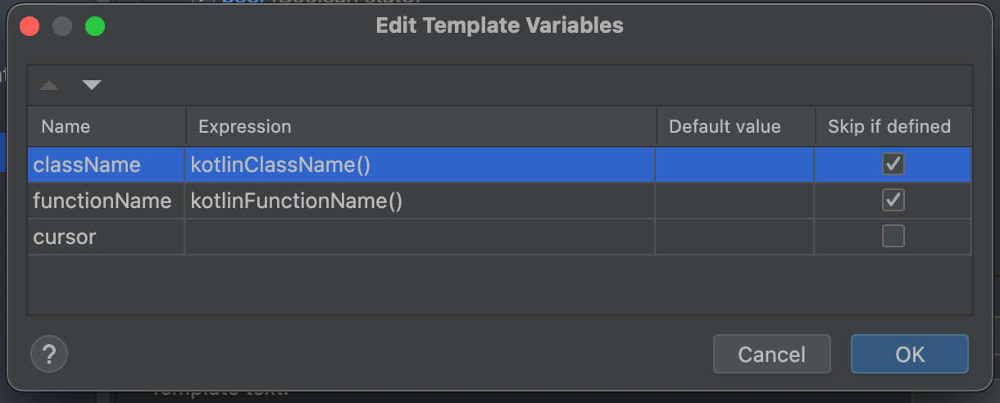

> The most effective debugging tool is still careful thought, coupled with judiciously placed print statements

 — Brian Kernighan , "Unix for Beginners" (1979)

## 📗 Context

**What's Caveman Debugging?**

Caveman debugging, also known as "printf debugging" is a simple and primitive method of debugging code. It involves inserting `print` statements throughout the code to track the program's execution and inspect variable values at different points.

**What's Live Template?**

Live Template is an IntelliJ IDEA feature that offers predefined code snippets allowing you to quickly insert commonly used code patterns or structures. These templates can also access the context they get called in. You can learn more about it [here](https://www.jetbrains.com/help/idea/creating-and-editing-live-templates.html)


## 🔀 Combining Both 

By combining caveman debugging and live templates, you can create a highly productive workflow. Here are my two most used custom live templates that I use almost everyday. It may look simple and trivial, but it helps a lot! (trust me!)

### 🏷️ Class name and function name

**Before - 19s**


**Live Template**

```
// sout
println("QuickTag: $className$:$functionName$: $END$")
```


**After - 5s**


### ⌛ Execution time

**Before - ~90s**


**Live Template**

```
// -
val startTime = java.lang.System.currentTimeMillis()

// --
println("QuickTag: $className$:$functionName$ :$cursor$: took ${java.lang.System.currentTimeMillis() - startTime}ms")
```



**After - 26s**


> The "QuickTag" text is then used to filter this in the logging window. 

## 🤷‍♂️ That's it?

Nope, there's more! I have many custom live templates that I use in my daily workflow, which I've been using for 5-6 years now...


**But**, most of these won't be useful to **YOU** (trust me again please).

This blog post is not about using Live Templates for printing class name and function name or adding timestamps easily. Rather, this blog post is about using a tool that fits your needs. Go analyse your workflow and find the most repeating and boring code you write every day, and write a custom live template for that. That'll definitely help you in the long term

## 🤝 Thanks

Oh, wow. You made it to the end. That means I probably didn't bore you or make you more confused. If that's not the case, please use the box below to share that. I'd be happy to take the feedback and reflect in the next blog. If you want to share your favorite Live Template, you can also comment that below. Thanks for reading!