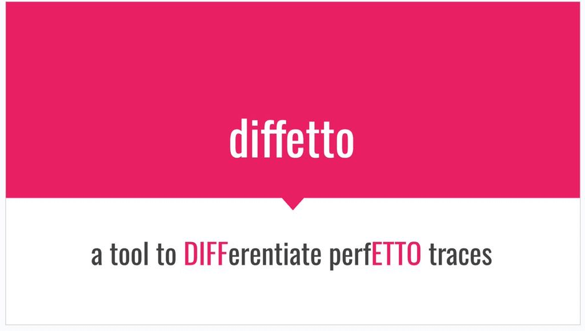
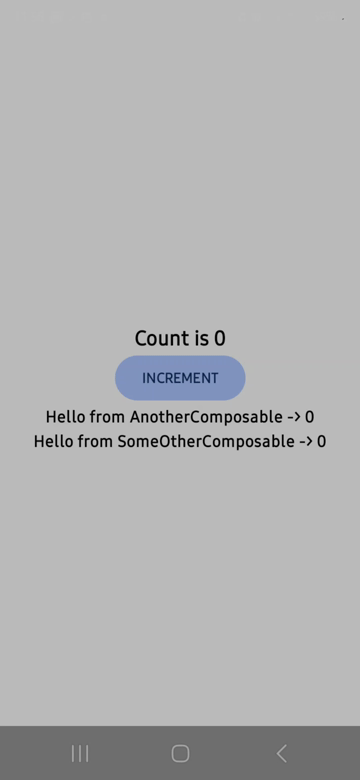
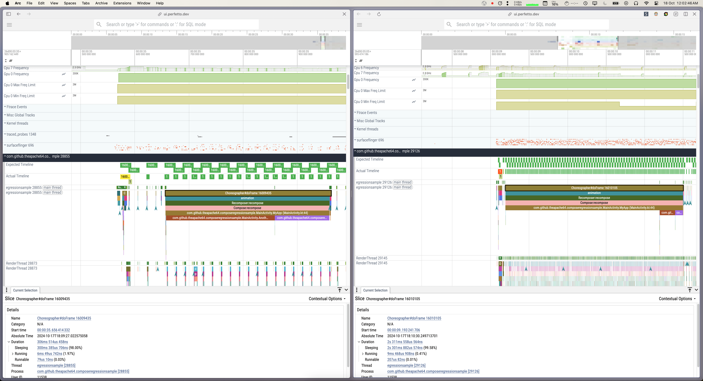
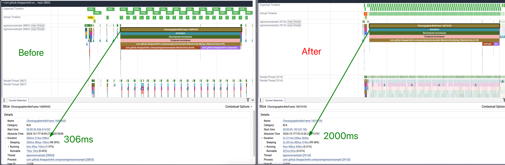
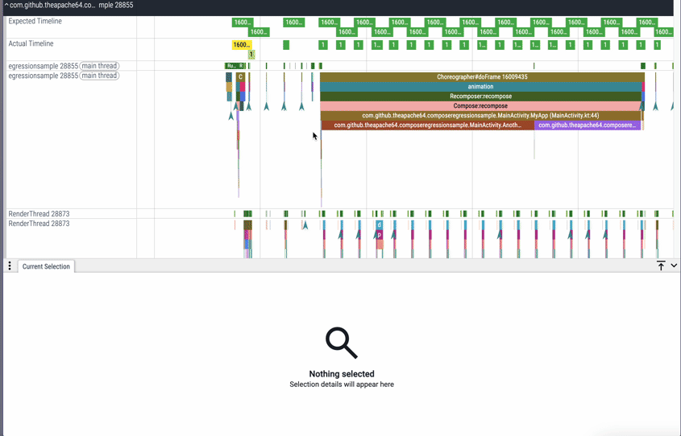
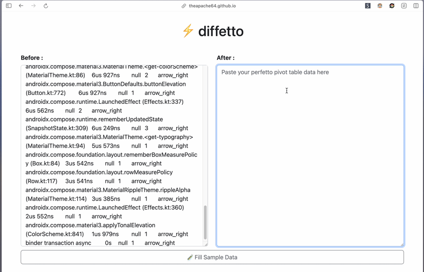
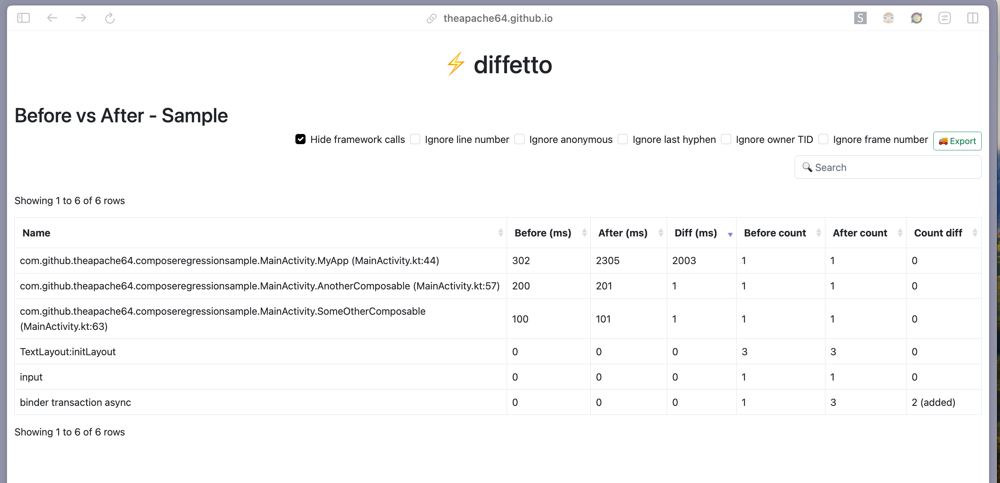
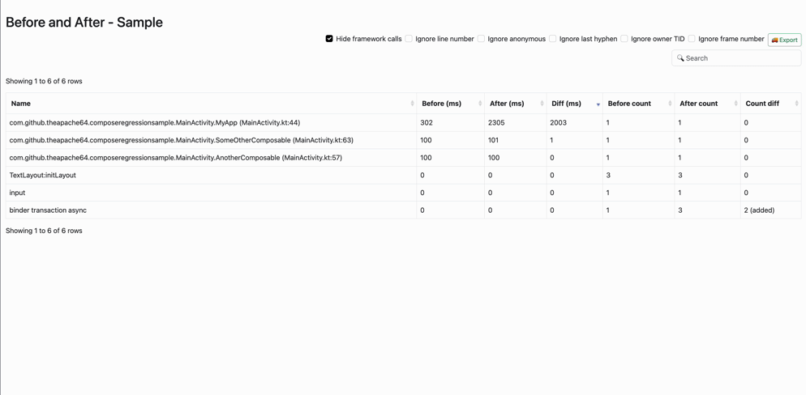
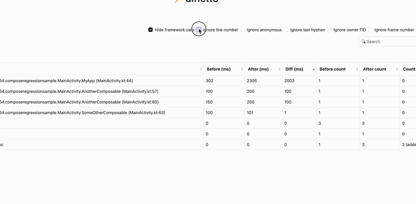
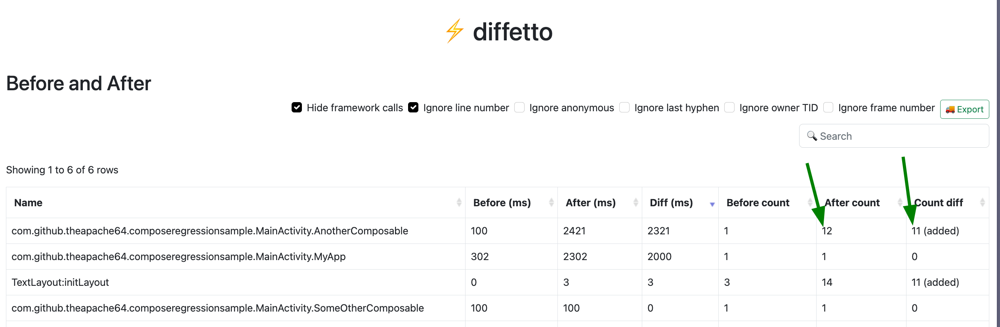

> Software is like entropy: It is difficult to grasp, weighs nothing, and obeys the Second Law of Thermodynamics; i.e., it always increases.

 — Norman Augustine

## 📜 Disclaimer

This blog isn't about the only way to detect performance regressions. It's just one of the apporaches I use. Like any tool, it's important to know when and where to use it, so consider if this method fits your situation. 

Let's go! 🚀

## 🙏🏼 Introduction

Every day new code gets added to codebases. New code basically means more need for memory and more time needed to execute. This will eventually reduce the performance of the app if the code is not written carefully. Regressions can be caught in two ways: either proactively (during PR reviews) or reactively (after it reaches your users and when they complain).

To proactively catch performance regression, we can use the [Macrobenchmark](https://developer.android.com/topic/performance/benchmarking/macrobenchmark-overview) framework. Macrobenchmark  runs the given scenario, _eg launch app, click buttons, scroll etc_, multiple times and produces a statistical summary. This summary tells you a number. A number that you can compare with your previous numbers to check if there's a regression or not. 

Then comes the reactive way. In this case, you probably don't have a fancy setup like Macrobenchmark. You only know the new version of the app has  performance regression because either your `Frozen Frame / Slow Frame` numbers shows regression in playstore or your users complaints the app is slow and laggy.

In both these scenarios (proactive and reactive), "what" exactly caused the regression is still hard to find, especially when you have hundreds if not thousands of Composables getting rendered in a second.

This blog is NOT about finding "if" there's a regression or not. Rather, this blog focuses on how to find "what" or "which" composable caused the regression, **easily**. 

In this blog, we'll be building an app, adding regressions and comparing the before and after version using [Perfetto](https://ui.perfetto.dev/) and [Diffetto](https://github.com/theapache64/diffetto) 

## 📗 Context

**What's Perfetto?**

Perfetto is a web based tool to visualize and explore trace files. It offers services and libraries for recording system-level and app-level traces. If you're new to Perfetto, I'd recommend watch [this](https://www.youtube.com/watch?v=phhLFicMacY) video before proceeding. Its one of the best videos that covers the basics of Perfetto.

**What's Diffetto?**



Diffetto is a tiny tool I wrote to diff two Perfetto traces. We'll see how to use it in this blog.


## 📱 The App

To make this blog simpler, I am going to write a `Counter` composable without a regression (before) and with a regression (after).

Before version:
```kotlin
@Composable
private fun MyApp() {
    var count by remember { mutableIntStateOf(0) } // state
    Text("Count is $count", fontSize = 20.sp) // text
    Button(onClick = { count++ }) { // button to update state
        Text("INCREMENT")
    }

    AnotherComposable(count) 
    SomeOtherComposable(count)
}

@Composable
fun AnotherComposable(count: Int) {
    Text("Hello from AnotherComposable -> $count")
    runBlocking { delay(200) } // simulating existing jank (200ms)
}

@Composable
fun SomeOtherComposable(count: Int) {
    Text("Hello from SomeOtherComposable -> $count")
    runBlocking { delay(100) } // simulating existing jank (100ms)
}
```

After version:
```kotlin
@Composable
private fun MyApp() {
    var count by remember { mutableIntStateOf(0) } 
    Text("Count is $count", fontSize = 20.sp) 
    runBlocking { delay(1000) } // introducing new regression of 1 second 🔴
    Button(onClick = { count++ }) { 
        Text("INCREMENT")
    }

    AnotherComposable(count)
    SomeOtherComposable(count)
}
```

Please keep in mind that our target here is NOT to find the bad code, but to find the regression (the new bad code).

## 🔎 Tracing

Setting up a Compose tracing framework and teaching you how to generate a trace file is out of the scope of this blog. The official guides are pretty good and straightforward.  You can follow [this](https://developer.android.com/develop/ui/compose/tooling/tracing) guide to setup tracing and [this](https://developer.android.com/topic/performance/tracing) to generate trace files.

While the above guide covers the basics of tracing, I'd like to mention a few things that are very important when doing Compose tracing.

1. Do not trace the `debug` build. Create a new `benchmark` variant that extends your release build configuration but without any ProGuard obfuscation. The reason is that Jetpack Compose includes many heavy features in debug builds for the IDE tools, also the compiler performs many optimizations on the release build. If you profile the `debug` build, you may end up fixing issues that are not actual user-facing problems, and you may overlook the actual problem. You can find more information on setting up a benchmarking variant [here](https://developer.android.com/topic/performance/appstartup/setup-env).

2. There are many ways you can generate trace files. You can [use your IDE](https://developer.android.com/studio/profile), [terminal](https://developer.android.com/topic/performance/tracing/command-line), and most latest Android device also supports [in-device tracing](https://developer.android.com/topic/performance/tracing/on-device). You can also use the [Macrobenchmark](https://developer.android.com/topic/performance/benchmarking/macrobenchmark-overview) framework to generate the trace files for you. IMO, The most simplest way is to use the IDE, but there's even a cooler way which I personally like the most, ie `record_android_trace` [command](https://perfetto.dev/docs/quickstart/android-tracing). This command records the traces and opens it auotmatically in perfetto with just one click. This is a huge time saver. 

3. Do not add tracing dependency using `implementation(...)` Use build variant-scoped `implementation` call. For example, use `"benchmarkImplementation"`. This is to prevent leaking the tracing dependency into your release build, which will increase the APK size.

4. Try to take short-duration traces. That'll help you narrow down problems faster. Lengthy traces will bring a lot of noise, making it hard to focus on one problem. For example, if you know there are issues when loading the page and also when clicking a Button within the page, don't combine these two interactions into one trace. Break it into two separate trace files and analysis.

## 👟 Tracing Steps

I've got the tracing setup done by following the above guides, and now we can move on to generating the trace files. I've followed the same steps given below in both the `before` (best version) and `after` (regressed version) apps for generating the trace file.

1. Open the app
2. Start tracing 
3. Click the Button
4. Stop tracing



## 🛠️ Analysing Trace

At this point, you should have two trace files. Let's call them `before.trace` and `after.trace`.
Now open them in [Perfetto](https://ui.perfetto.dev). For easier comparison, I usually open them side by side like this.



And as you can see, there's the regression we added.



Now, you may be wondering, _"Why do we need another tool to find the regressed component? It's clearly visible in the screenshot itself 🤷🏼‍♂️"_ You're right! In this case, it's true. **But**, in a real-world app, there could be hundreds ,if not more, composables getting rendering at the same time, and it's really hard to get a visual like this and to see the regression right away. 

## ⚡ Diffetto

[Diffetto](https://github.com/theapache64/diffetto) is a tiny web app (built using Compose Web) that can help narrow down the regression from two trace files. Here's how to use it:

In Perfetto, when you select a region, you'll get a "Pivot Table". Copy the pivot table data of both before and after like this



and then, paste them into [Diffetto](https://theapache64.github.io/diffetto/)'s before and after boxes respectively.



Once done, press the "Find Diff" button and the tool will generate a table like this



As you may have now realized, Diffetto is nothing but a text processing tool. It converts the text you give into a table. But Diffetto is not just a text-to-table converter. It knows certain things about these trace data. Basically, it's aware of certain nodes and what each node means. This knowledge is then used for the filters you see in the top right. The filters are used to narrow down to the culprit and reduce noise that comes from the trace file. Let's look at some filters: 

**Filters:**
- `Hide framework calls` : To hide [certain](https://github.com/theapache64/diffetto/blob/b1f315ad32dd3e40a7954501cb505bfe5994c283/src/jsMain/kotlin/core/FrameworkCallsFilter.kt#L13-L32) Android framework calls that present in most traces. Eg: `androidx.compose.*`, `Choreographer#*`, etc



- `Ignore line number` : To ignore line numbers in the trace node, Eg: `MyApp (MainActivity.kt:44)` will be shown as `MainActivity.MyApp`, so that different usages of the same Composable gets merged into one node. Another example would be, if you've `MyApp (MainActivity.kt:44)` with `100ms` and `MyApp (MainActivity.kt:60)` with `150ms`, both these nodes gets merged into one row with `MyApp` and the duration will be `250ms` with `Count` being `2`



_see what's happening to `AnotherComposable`_ ☝🏼

Similarly, other filters are also used to modify the rows for different use cases. You can see all filters [here](https://github.com/theapache64/diffetto/tree/master/src/jsMain/kotlin/core). This helps a lot in a real-world app's trace file where you'll have too much noise.

Coming to the table itself, by default, it is sorted by the `Diff (ms)` column in descending order. That means your top-most regression will be the first row. As you can see from the above screenshot, the `2000ms` delay we added is clearly visible in the `Diff` column. Also, if you notice, the other composable functions, the `Diff` column is almost zero, which means no regression. You can control the ordering by click on each column header, and it will rearrange the table accordingly.

**🔄 Recomposition regression**

With Diffetto, you can also debug [recomposition](https://developer.android.com/develop/ui/compose/lifecycle#add-info-smart-recomposition) regressions o find the most recomposing composable. The `Before count`, `After count` and `Count diff`, (which is `after - before`), columns shows the number of nodes with the same name in the trace. That means, one node = 1 (re)composition. Let's modify the `AnotherComposable` to have some unnecessary recomposition and see how the Diffetto shows it

```kotlin
@Composable
fun AnotherComposable(count: Int) {
    var anotherState by remember { mutableIntStateOf(0) } // adds a new state
    LaunchedEffect(count) {
        anotherState = 0
        delay(2000) // wait for parent runBlocking to settle down
        while (anotherState < 10) {
            anotherState++ // increments it every 100ms until it reach 10; 
            delay(100)
        }
    }

    Text("Hello from AnotherComposable -> $count $anotherState") 
    runBlocking { delay(200) }
}
```

now the Diffetto table looks like this



As you can see, the additional 10 recompositions we added for `AnotherComposable` are now visible in the diff tool table.

## ✍🏼 Concluding...

I must say, while Diffetto is a tiny app, the power of Diffetto is not really visible in this sample app. 

To give you some context, the app I work on, is a fully Compose app, with over a billion downloads on the Play Store. In the early days of Compose, where we didn't have enough support around Macrobenchmarking, finding performance regression was tough with more than 200 of composable getting rendered in a second. In such an environment, the trace becomes too noisy. There, Diffetto played a crucial role in reducing the noise and in turn help find the culprits faster. If you've similar situation, where you basically have two version of the app and don't know what's regressed, I'd suggest try this approach on that. "Diffetto" can also be used in non-compose apps, by the way.  

## 🤝 Thank you

Oh, wow. You made it to the end. That means I probably didn't bore you or make you more confused. If that's not the case, please use the box below to share that. I'd be happy to take the feedback and reflect it in the next blog. If you want to share another approach or any improvement on this approach, you can also comment below. Thanks for reading! Visit again 👋🏼