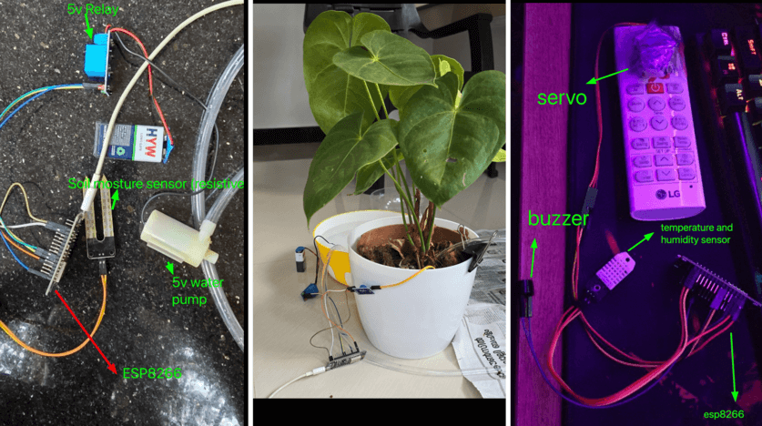
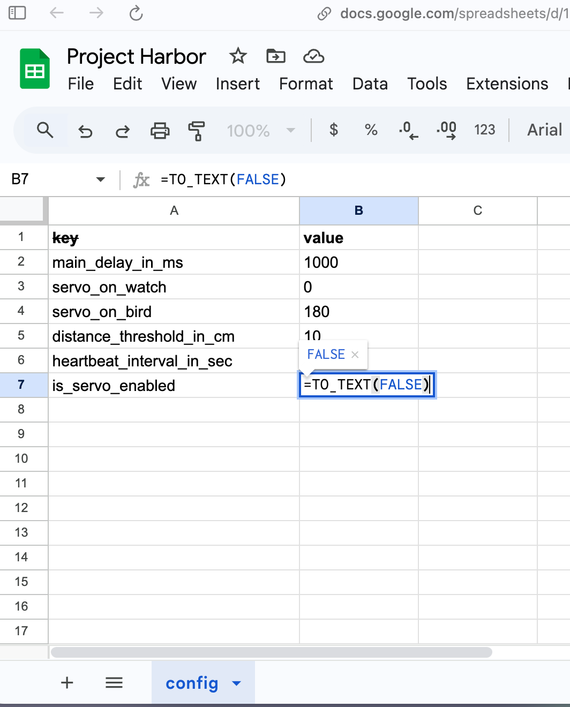

## 📖 Context

Recently, I started playing with microcontrollers (MCUs) for the first time in my life. I was so excited and it felt incredible to move a physical part (water pump, servo, etc.) with code, probably because I've mostly been writing software for mobile apps and web apps 😄. While I’d love to share the fun and stories behind the projects, this blog focuses on how I solved one of the problems I faced. I’ll save the project stories for another time ;) (stay tuned)




Source: 
- https://x.com/theapache64/status/1776345276984283199
- https://x.com/theapache64/status/1768999825658335299
- https://x.com/theapache64/status/1768966949533278276

## 🥲 Problem Statement

Alright. Let's talk about the problem. 

The microcontroller I am mainly using is the `ESP8266`/`ESP32` and it takes around 20-25 seconds to "upload" the code to the MCU. While it's better than the Android build time at work (😜), any variable change taking 20-25 seconds feels kinda off. Plus, while reading more about it, I found that these microcontrollers have a limit on how many times I can "upload" the code (write/erase cycle). The limit is between 10,000 to 100,000 write/erase cycles, but the exact number can vary based on environmental factors such as temperature and how frequently I write (source: perplexity.ai - CMIIW). 


Since I am new to the world of microcontrollers, most of my "uploads" (flashes) for tweaking variable values out of curiosity about what would happen or to match certain behaviors. For example, I'd experiment with different servo angles, water pumping durations, loop delays, etc 

## 💡 Idea


Since each upload takes 20-25 seconds and it wears out the device, I decided to write a remote config that can fetch values from somewhere on the internet.

I chose Google Sheets for this purpose, mainly because I don't have to maintain a server, pay any subscription fees, build any UI, and I can take full advantage of the features of Google Sheets (yeah am lazy bro :/). So here's what I did


## 🦶🏼 Step 1 : Create Sheet

First, I created a Google Sheet like this.



## 🦶🏼🦶🏼 Step 2: Write config class

Then I wrote a `Config` class that uses Google Sheet's "auth free CSV endpoint" to download the values as key-value pairs. 
The only requirement is that your sheet has to be publicly readable.

```c++
#include <ESP8266WiFi.h>
#include <map>
#include <string>
#include "NetworkClient.h"

class Config {
   private:
    std::map<String, String> configCache;
    const String sheetId = "1OzhdDoPW-slnVct42AsFLe2zNJJrFReHDz5Gv6hccsA"; // you can get this ID from your share url
    const String sheetName = "config"; // this is sheet's name 

   public:
    /**
    * To return corresponding value for the given key. If not found, will return the defVal
    */
    String getConfig(String key, String defval) {
        // check if config cache is empty
        if (configCache.empty()) {
            loadConfig();
        }

        std::map<String, String>::const_iterator it = configCache.find(key);
        if (it == configCache.end()) {
            return defval;
        } else {
            return it->second;
        }
    }

    void loadConfig() {
        Serial.println("Loading configs...");
        HTTPClient request;
        NetworkClient client;
        if (request.begin(*client.httpClient,"https://docs.google.com/spreadsheets/d/"+ sheetId + "/gviz/tq?tqx=out:csv&sheet=" + sheetName)) {
            int responseCode = request.GET();
            Serial.println("Response code: " + String(responseCode));
            if (responseCode > 0) {
                String payload = request.getString();
                // Parse the payload and populate the data map

                int startPos = 0;
                int endPos = payload.indexOf('\n');
                bool isLastItem = false;
                while (endPos != -1) {
                    Serial.println("---------------");

                    String line = payload.substring(startPos, endPos);

                    int commaPos = line.indexOf(',');
                    if (commaPos != -1) {
                        String key = line.substring(1, commaPos - 1);
                        key.replace("\"", "");
                        String value =
                            line.substring(commaPos + 2, line.length() - 1);
                        value.replace("\"", "");

                        configCache[key] = value;
                    }
                    startPos = endPos + 1;
                    endPos = payload.indexOf('\n', startPos);
                    if (isLastItem) {
                        break;
                    }

                    if (endPos == -1) {
                        endPos = payload.length();
                        isLastItem = true;
                    }
                }

                Serial.println("Config loaded successfully!");
            }
        }
        request.end();
        Serial.println("Config load finished");
        
    }

    /**
    * To return all config key-value as one string (for logging)
    */
    String allConfigs() {
        String str = "";
        for (std::map<String, String>::iterator it = configCache.begin();
             it != configCache.end(); ++it) {
            str += it->first + "=" + it->second + ";";
        }
        return str;
    }

    void refreshConfigs() {
        Serial.println("Refreshing configs...");
        configCache.clear();
        configCache = std::map<String, String>();
        loadConfig();
    }
};
```

(I hope the code is self-explanatory 🙂)

## 🤓 Usage

Here's an example of how I am using it...

```c++
#include <Arduino.h>
#include <WiFi.cpp>
#include <map>
#include <string>
#include <Config.cpp>

WiFiConnection wifi;
Config config;

void setup() {
  Serial.begin(115200); 
  wifi.connectToWifi();
  config.loadConfig();
}


void loop() {
  ...
  bool isServoEnabled = config.getConfig("servo_enabled", "FALSE") == "TRUE";
  int distanceThreshold = config.getConfig("distance_threshold_in_cm", "10").toInt()

  if(distanceCm < distanceThreshold) {
    if(isServoEnabled) {
      servo.write(config.getConfig("servo_on_bird", "90").toInt());
    }
    ...
  } else {
    if(isServoEnabled) {
      servo.write(config.getConfig("servo_on_watch", "0").toInt());
    }
    ...
  }
  
  ...

  if(millis() - lastHeartbeatSentAt > config.getConfig("heartbeat_interval_in_sec", "60").toInt() * 1000.0) {
    ...
    config.refreshConfigs();
  }
  
  delay(config.getConfig("main_delay_in_ms", "1000").toInt());
}
```

Please note: this is a real-world example with unrelated code redacted for the sake of clarity. You can find the full code [here](https://github.com/theapache64/harbor/blob/master/src/main.cpp)

## 📜 Source Code

If you want to reuse this approach in your projects, you can simply copy and paste the above `Config` class and use it by changing the `sheetId` and `sheetName`. Here's the [full code](https://github.com/theapache64/harbor/blob/master/src/Config.cpp)

If you want to use the same method for your Android or JVM apps, you can use my library called [retrosheet](https://github.com/theapache64/retrosheet). It uses the same principle, but fancier way ;) 

## 🤝 Thanks

Oh, wow. You made it to the end. That means I probably didn't bore you. If that's not the case, please use the box below to share your thoughts. I'd be happy to take your feedback and reflect on it in the next blog. Also, the code and project may felt "sub-optimal" (I am super new to C++ and microcontrollers), but I am open to feedback, so feel free to share your thoughts also below 🙂 Thanks for reading! :)