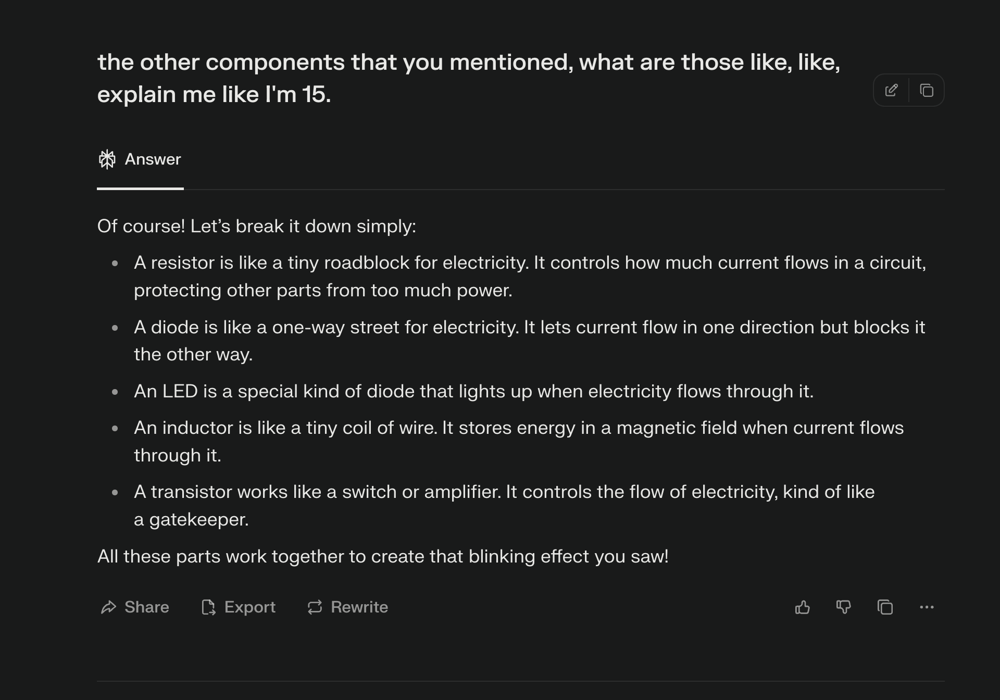

> Disclaimer: this post is written in a raw, unstructured, real-time format and celebrates small wins, honest mistakes, and the messy process of learning and building. It's not the ultimate guide - just what worked for me, shared as-is. If you like seeing how things break and get fixed, you're in the right place!

I love fireflies. But in recent years, they stopped coming for reasons I don't know. No tiny, glowing dots in the dark like they used to. I miss them more than I expected.

Few weeks ago, I decided to make my own fireflies. I discovered something called an [Astable Multivibrator](https://www.electronics-tutorials.ws/waveforms/astable.html). It looked like magic to me TBH. A tiny circuit, with **minimal** components, that could automatically switch from ON to OFF and OFF to ON state (without an explicit "timer" component). 

But there was one big problem: I didn’t know the first thing about electronics, not even the difference between voltage and current. Plus, now I needed to learn what a resistor, a capacitor, and a transistor is. 

It was slow going, but step by step, I picked up the basics. I kept asking AI tools with my questions—sometimes embarrassingly simple ones and slowly, the fog began to lift 😇

Loaded with just enough theory (and a lot of YouTube and AI advice), I took my bike with a shopping list in my pocket and bought my first few components. 

Back at home, I assembled my first blinking LED circuit. To my surprise, it worked on the first try!! (even softwares don't do this, IYKYK 🤷🏼‍♂️). 

But somethings still bugged me. One, it blinks all day. Two, the LED blinked too fast. Fireflies don't blink this fast and they don’t blink all day. These were true deal breakers for me. 

I wanted my firefly to only blink at night and slow down the blinking. The first part wud also cut the energy consumption by half. I asked my first question: "How can I make it blink only at night?" Perplexity introduced me to the LDR (Light Dependent Resistor). I was mind-blown. That’s exactly what I needed. I couldn't believe it. It sounded like AI hallucination to me at that time TBH. Just to be sure, I checked if LDRs are real. They are! I jumped on my bike and rushed to the shop again. Got few. Soldered one into my circuit.

It did NOT work! I realized I connected it wrong (my bad, Perplexity’s bad, or maybe we both 🤷🏼‍♂️). Once I hooked it up correctly, it was like magic: the LED would stay ON only in the dark. Even better, I learned I could adjust the sensitivity by adding a resistor in series with the LDR.

To fine-tune the blink delay, I discovered I can tweak the capacitor and resistor values. But trying resistors one by one felt like a boring task. I discovered something called a Potentiometer that's more like a dynamic resistor that has a knob you can twist to increase and decrease the resistance. Guess what? Took the bike, bought it, connected it, and found the sweet spot. I swapped out a 100kΩ resistor for the sweet spot 500kΩ and noticed the interval between blinks stretched from 1 to 5 seconds. I experimented with different capacitor values also and, after a lot of trial and error, even built my own little web-based simulator to predict blink delays -> https://a64.in/tools/astable-delay-simulator.html (I guess the software guy in me couldn't rest!). 

After that, I wanted to verify if my resistor and capacitor values were optimal. I learned how to measure power consumption with a multimeter and discovered that using a lower-value capacitor and higher resistance was best. I built another calculator ,https://a64.in/tools/battery-life-calculator.html, to estimate how long my “firefly” would glow before the battery died — it showed over ~8 months, by my math. 

But the road was not always smooth 🥲 

**Incident#1:** My circuit stopped working. I tested all the components one by one — everything was working. Losing hope, I went to bed. The next morning, I thought: "What if it's not the components—what if it's the wires?" I tested each jumper wire and some of them were broken or had high resistance (I don't think I'll ever be able to trust jumper wires ever again :(). From then on, I began using "hookup wires".

**Incident#2:** I missed having a simulator, so I searched the web and found tinkercad.com has a circuit simulator where you can drag and drop all the components and see if and how it works. It worked for simple circuits, but for mine, the astable multivibrator, it didn't for some reason. I tried [falstad.com/circuit](https://tinyurl.com/2avzjyyn); the same thing happened. It also didn't work. I searched the web for the reason, and I've noticed that sometimes these simulators don't work well for complex circuits.

**Incident#3:** The solder smoke. It was causing breathing issues (or at least I felt a difference in breathing after soldering). To help with that, I ripped out a cooler fan from an old CPU and connected it with a 12v spare adapter and used it as a fume extractor (or redirector? I don't know what you call it).

**Incident#4:** One midnight, I realized I needed a 22μF capacitor instead of a 10μF. I opened up a broken power supply board. For the first time, it looked familiar. "Ahh.. capacitors, resistors and transistors 😂".. I tilted the board left-and-right to find the capacitor number, found one, and carefully desoldered a 22μF capacitor. It felt like magic — free electronics components from broken boards! 

**Incident#5**: Debugging Step: Putting the finished circuit in a dark room and looking from far away to see if it really looked like a firefly. That one little blinking light brought me a big sense of joy.

Mounting everything neatly was another adventure. My freeform circuits constantly toppled over or looked ugly—so I reached for hot glue, tried a cheap 3D pen, and fumbled through DIY “stands.” Ugly looking, but functional. Each new firefly felt more robust than the last.

Eventually, I built five “fireflies” - one on a breadboard for tinkering and tuning, the others soldered together “dead bug” style and sealed in clear covers for the outdoors. 

The night I saw their gentle blinks line up in the dark, it was pure, peculiar joy. (ohh man!)

I took a pause and looked back… “What am I doing? Why am I so happy and excited?”
The last time I felt this deeply immersed was when I was learning my first programming language, PHP, 7 or 8 years ago. Now, I realized, I was once again fully absorbed—learning something entirely new, stumbling and getting back up every time I failed. That's what truly gave me a sense of purpose and excitement.

- Schematics: https://tinyurl.com/2avzjyyn

I’m already eager to build even better “fireflies,” blinking smarter, shining longer. I don’t know exactly where this all leads, but I know now: the thrill is in the making, the learning and the falling.  

To be continued...