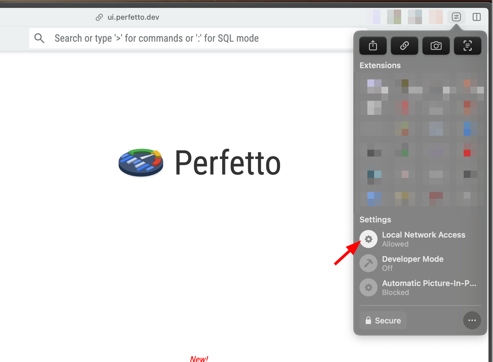
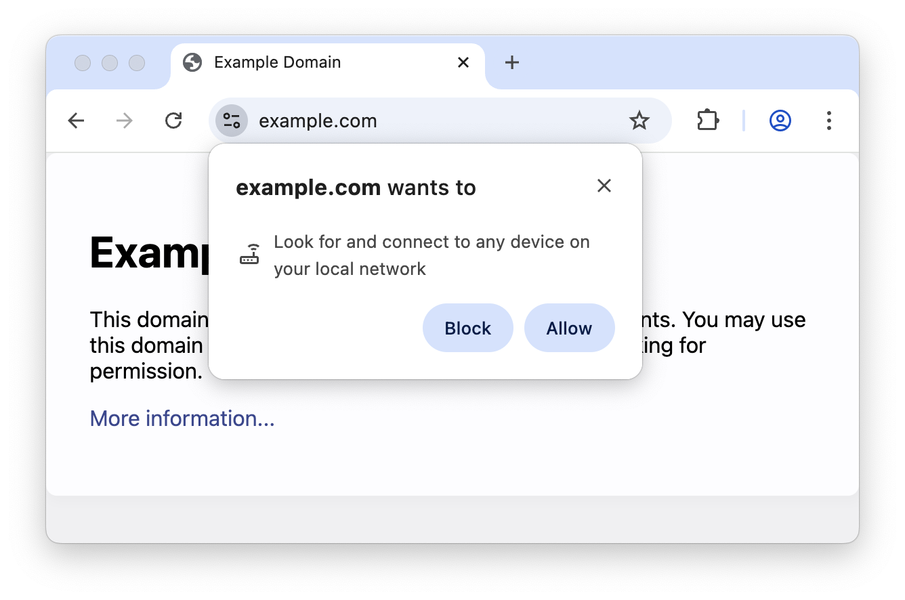

I love the `record_android_trace` [script](https://github.com/google/perfetto/blob/main/tools/record_android_trace) from Perfetto. 
It makes the trace recording + uploading process easy with just a couple of keystrokes. 
No more manually dragging files into the UI or dealing with file paths - just run the script, and boom, your trace opens right in the browser.

But yesterday, when I ran it, I got hit with this error:

> **Could not load local trace TypeError: Failed to fetch**

Hmm. This used to work perfectly fine. What changed?

Looking at the browser console, I found the culprit:

```
Access to fetch at 'http://127.0.0.1:9001/sample.trace' from origin 
'https://ui.perfetto.dev' has been blocked by CORS policy: 
Permission was denied for this request to access the `unknown` address space.
```

So it's a **CORS policy** thingy but is this new? 
I found the [blog post](https://developer.chrome.com/blog/local-network-access) related to this. 
Basically, the browser is now blocking requests from `https://ui.perfetto.dev` to `localhost` (local network). 
It treats requests from public websites to local/private IP addresses as potentially dangerous and block them by default. (TIL)


## #1: The Easy Fix

Am not sure if other Chromium-based browsers support this, but in Arc, you can click on the site menu icon in the address bar and allow LAN access for the specific site.
In this case, for `https://ui.perfetto.dev`.



(In other chromium browsers, you might find similar options in the site settings -> `chrome://settings/content/siteDetails?site=https://ui.perfetto.dev/`)


## #2: The Flag Fix


If you want this to enabled only when you are viewing Perfetto traces locally, you can launch the browser from the terminal with these flags.

```bash
open -a "Arc" --args --disable-web-security --user-data-dir=~/chromeTemp
```

This bypasses the CORS restrictions for that browser session. Not ideal for everyday browsing, but perfect for local trace viewing.

## #3: Integrated Flag Fix

Rather than manually launching a special browser window every time, you can modify the `record_android_trace` script to do it automatically.

**Before (original script):**

```python
def open_trace_in_browser(path, open_browser, origin):
  ...
  with socketserver.TCPServer(('127.0.0.1', PORT), HttpHandler) as httpd:
    address = f'{origin}/#!/?url=http://127.0.0.1:{PORT}/{fname}&referrer=record_android_trace'
    if open_browser:
      webbrowser.open_new_tab(address)
    else:
      print(f'Open URL in browser: {address}')

    ...
```

**After (with the fix):**

```python
def open_trace_in_browser(path, open_browser, origin):
  ...
  with socketserver.TCPServer(('127.0.0.1', PORT), HttpHandler) as httpd:
    address = f'{origin}/#!/?url=http://127.0.0.1:{PORT}/{fname}&referrer=record_android_trace'
    subprocess.Popen([
        'open', '-a', 'Arc', address, '--args',
        '--disable-web-security',
        '--user-data-dir=' + os.path.expanduser('~/chromeTemp'),
    ])

    ...
```

The key change: instead of using Python's `webbrowser.open_new_tab()`, we use `subprocess.Popen()` to launch the browser directly with the `--disable-web-security` flag and a temporary user data directory.

You can swap `'Arc'` with `'Google Chrome'` or whatever Chromium-based browser you use.

I've put together the full modified script here: [gist.github.com/theapache64/38f074d0b1d4f3298aaa89f5cbb068da](https://gist.github.com/theapache64/38f074d0b1d4f3298aaa89f5cbb068da)

## #4: Browser-wide Disable (Not Recommended)

You can go to `chrome://flags/#local-network-access-check` and disable it browser-wide. 
But I'd not recommend this as it reduces your browser's security for all sites.

## Final Thoughts

I think Perfetto needs to implement a permission request for LAN access. This way users can grant access when prompted, similar to how location or camera permissions work.


Happy tracing! 🔍
