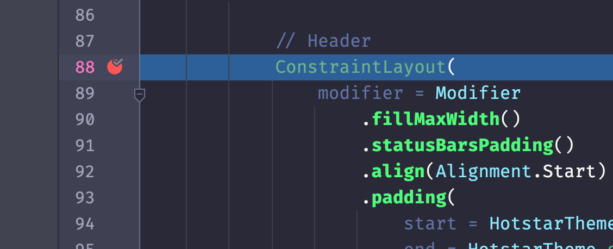

## 📄 Disclaimer

This blog is intentionally unpolished. I wrote it directly from my thoughts, so it may include some unnecessary or awkward sentences, but I chose to leave them in. The rawness is part of its purpose.

## 📗 Context

At work, I get to work on a lot of interesting issues. And there were too many interesting stories to tell, which I don't remember fully enough to write as a blog now. So I was thinking of documenting my next debugging session while I debug and this is _that_ blog.

At this point, I have a crash in my hand that looks weird (i think most crash at the initial stage looks weird and here's am no difference).
So let's debug together.

## 💥 Crash

My teammate is currently trying to update our [Jetpack Compose](https://developer.android.com/compose) version from `1.5.x` to `1.7.x` (yeah, that's a long jump). Today, he mentioned that he got a crash. He was saying the app works in one region (let's call it `R1`) and crashes in the other region (let's call it `C1` - `C` stands for crash). He share a stack trace and it looks like this:

```
Fatal Exception: java.lang.IllegalStateException: Size(0 x 2147483647) is out of range. Each dimension must be between 0 and 16777215.
   androidx.compose.ui.node.LookaheadCapablePlaceable.layout (LookaheadCapablePlaceable.java:2)
   androidx.compose.ui.layout.MeasureScope.layout$default (MeasureScope.java:4)
   androidx.compose.ui.layout.MeasureScope$DefaultImpls.layout$default (MeasureScope.java:52)
   androidx.constraintlayout.compose.ConstraintLayoutKt$rememberConstraintLayoutMeasurePolicy$1$measurePolicy$1.measure-3p2s80s (ConstraintLayout.kt:52)
   androidx.compose.ui.node.InnerNodeCoordinator.measure-BRTryo0 (InnerNodeCoordinator.java:13)
   androidx.compose.foundation.layout.FillNode.C (FillNode.java:98)
   androidx.compose.ui.node.LayoutModifierNodeCoordinator.measure-BRTryo0 (LayoutModifierNodeCoordinator.java:6)
   androidx.compose.foundation.layout.AspectRatioNode.measure-3p2s80s (AspectRatioNode.java:18)
   ...
```

He also spotted it in the Google issue tracker : https://issuetracker.google.com/issues/335524398

Based on the stack trace, the crash is happening from the `ConstraintLayout` library. So, he updated the version to the latest stable, which is `1.1.0-rc01`, and the crash is fixed.

This is what we usually do when an unexpected crash occurs. We update the dependency or the class causing the crash and try it again without even looking at the code, because historically speaking, the time spent debugging these issues never ended up with a happy ending.

But, this time, with that _region_ part involved, I got curious about what might be the reason for such a crash. What's interesting is that both regions run on the same codebase. So any UI crash present in one region should ideally be present in the other region as well. This is puzzling because this is something that should not have happened based on the structure of the code.

Please note my goal with this blog is to explore the issue as much as I can within the _limited time_ I have. Since the solution is already available and I can't spend too much time digging deeper on this.

## 🪲 Reproducing

The first step of any crash is reproducing it. Let me switch my VPN to `C1` and see if I can reproduce the crash
(checking...)
YES! it crashed

```
FATAL EXCEPTION: main
Process: com.myapp, PID: 18074
java.lang.IllegalStateException: Size(992 x 2147483647) is out of range. Each dimension must be between 0 and 16777215.
	at androidx.compose.ui.internal.InlineClassHelperKt.throwIllegalStateException(InlineClassHelper.kt:26)
	at androidx.compose.ui.node.LookaheadCapablePlaceable.layout(LookaheadDelegate.kt:576)
	at androidx.compose.ui.layout.MeasureScope.layout(MeasureScope.kt:54)
	at androidx.compose.ui.layout.MeasureScope.layout$default(MeasureScope.kt:49)
	at androidx.compose.ui.layout.MeasureScope$DefaultImpls.layout$default(MeasureScope.kt:49)
	at androidx.constraintlayout.compose.ConstraintLayoutKt$rememberConstraintLayoutMeasurePolicy$1$measurePolicy$1.measure-3p2s80s(ConstraintLayout.kt:125)
	at androidx.compose.ui.node.InnerNodeCoordinator.measure-BRTryo0(InnerNodeCoordinator.kt:135)
	at androidx.compose.foundation.layout.PaddingNode.measure-3p2s80s(Padding.kt:414)
	at androidx.compose.ui.node.LayoutModifierNodeCoordinator.measure-BRTryo0(LayoutModifierNodeCoordinator.kt:188)
	at androidx.compose.foundation.layout.InsetsPaddingModifier.measure-3p2s80s(WindowInsetsPadding.kt:359)
	at androidx.compose.ui.node.BackwardsCompatNode.measure-3p2s80s(BackwardsCompatNode.kt:312)
	at androidx.compose.ui.node.LayoutModifierNodeCoordinator.measure-BRTryo0(LayoutModifierNodeCoordinator.kt:188)
	at androidx.compose.foundation.layout.FillNode.measure-3p2s80s(Size.kt:699)
	at androidx.compose.ui.node.LayoutModifierNodeCoordinator.measure-BRTryo0(LayoutModifierNodeCoordinator.kt:188)
	at androidx.compose.ui.node.LayoutNodeLayoutDelegate$performMeasureBlock$1.invoke(LayoutNodeLayoutDelegate.kt:316)
	at androidx.compose.ui.node.LayoutNodeLayoutDelegate$performMeasureBlock$1.invoke(LayoutNodeLayoutDelegate.kt:315)
	at androidx.compose.runtime.snapshots.Snapshot$Companion.observe(Snapshot.kt:503)
	at androidx.compose.runtime.snapshots.SnapshotStateObserver$ObservedScopeMap.observe(SnapshotStateObserver.kt:502)
	at androidx.compose.runtime.snapshots.SnapshotStateObserver.observeReads(SnapshotStateObserver.kt:258)
	at androidx.compose.ui.node.OwnerSnapshotObserver.observeReads$ui_release(OwnerSnapshotObserver.kt:133)
```

Now let me switch to `R1` and verify it's not crashing...
(checking...)

Verified. It's not crashing!! This is truly interesting.

## 📜 The Stacktrace

Now let's look at the stacktrace and see what its telling.

1. Historically speaking, just like most of the puzzling Compose stacktrace, this stacktrace doesn't have anything pointing back to our code. So we don't know where its triggering from. This is the most frustrating part
2. Based on the above repro step, the crash happens after moving from constent screen, and it crashes in the next screen, which is our login page.
3. The stacktrace header, `java.lang.IllegalStateException: Size(992 x 2147483647) is out of range. Each dimension must be between 0 and 16777215.` says something went out of bound. but What's `2147483647`? looks familiar... let me google that,


ohh that's our `Int.MAX_VALUE` and what about `16777215` ?


> The number 16,777,215 is the total possible combinations of RGB(255,255,255) which is 32 bit colour.

Hmm... how come dimension and color collided together? 🤔 Or are these numbers not what I think they are? 🤷🏼‍♂️

Let's check the file it got triggered from - thanks to modern IDEs - we can navigate from stacktrace to library files directy. So that's `InlineClassHelper.kt:26`, to be precise `androidx.compose.ui.internal.InlineClassHelper.kt` at line no `26`.

There we go


That looks like a utility function to throw an exception. The actual call came from elsewhere... let's backtrack...


That's where the crash message gets constructed, and `16777215` is not a color here, but an upper limit of `16 million`. So it's not actually some collision between dimension and color. This looks like the `ConstraintLayout` tried to draw out of where it's supposed to be.

I think what may have happened is, at some point `ConstraintLayout` passed `Int.MAX_VALUE` for `height`, which was compatible previously. This check, which is probably introduced in the recent version of `LookaheadDelegate`, which is in a in a different Compose dependency, was transitively upgraded during the `1.7.x` update — probably caused the crash.

Now we somewhat know how the crash is happening! but our primary question stays the same. **How come same code has different behaviour in different region**. My best guess, at this point, is that it's not the same code. There might be some `ConstraintLayout` code which gets triggered only in the `C1` region, which is crashing for `C1`, and that never gets called in `R1`.

Let's look at such cases where `ConstraintLayout` getting used only in `C1`. Since we don't have a trigger point back to our code, our best friend at this point is IDE string search, and since we know its happening in login, lets search that module first.

(checking...)

mhm... its not there... 🤔 another weird data point.. could be in some other modules... lets do project wide string search and only keep an eye for login related file names


132 usages... hard to go one by one.. is there any easier way to do this? how about click use "Find usages" on one instance


alright.. only 45.. much better...

Is there any way I can put breakpoints on all 45 instances with just one click? Nope... (I hope IntelliJ will get there someday) :( Let's do it manually, but only pick login-related files.


and looks like there's only one instance.. (feeling lucky).. let's see if its behind a region check or something like that...

(checking...)

its not 🤔 hmm... wait.. login screen.. right? it has phone input field.. the only difference between would be... the country code shown... the `R1` country code is `+91` and `C1` country code is `+27`, would that be somehow related? wait... hold on.. let me take a paper and write it down.. we'll come back to this if current theories are invalid... (preventing the urge of jumping into another potential cause, but tracking it in a paper)

Now, at this point, the easiest first step is to check if we're getting a hit on the breakpoint, let me run the app in debug mode.



okay.. we got a hit

And after `F9` (continue), it crashed as expected. So this ConstraintLayout is involved. But is this ConstraintLayout crashing the app? Is there any other ConstraintLayout outside the module crashing it? Let's comment the ConstraintLayout and run the app again, this time debugger not needed.

(checking)

NOT CRASHING!!! That's a great news! We have our culprit in hand.. now.. lets find "WHY" ? Is this caused by the children in the CL (ConstraintLayout) or its just the `CL`. let's remove all the children and see if its crashing...

```kotlin
ConstraintLayout(
    modifier = Modifier
        .fillMaxWidth()
        .statusBarsPadding()
        .align(Alignment.Start)
        .padding(
            start = CustomTheme.spacings.onBoardingHeaderHorizontalPadding,
            end = CustomTheme.spacings.onBoardingHeaderHorizontalPadding,
            top = 12.dp, bottom = 12.dp
        )
) { }
```

Crashing!! Wow, I didn't expect that. So, are these the params or... again... it's just `CL`... Let's remove the param and see.

```kotlin
ConstraintLayout() { }
```

Crashing!! Wowowoo!!! 😮 What's going on here! (taking a step back...)

This is crashing without any external input from my side, so it's mostly a framework issue. What if I move the `CL` to somewhere else? I mean, does it crash if i move the CL to the top level?

(checking...)

Not crashing!! Oh my god!! What the hell!

How about just one level up?

(checking)

not crashing... hmmm... what's special there in the parent? 🤔

```kotlin
Column(
    modifier = Modifier
        .fillMaxSize()
        .verticalScroll(scrollState)
        .imePadding()
        .navigationBarsPadding()
) {
    ConstraintLayout {

    }
}
```

It looks okay...maybe the params causing the crash? maybe that `fillMaxSize()` somehow? lets remove all params

```kotlin
Column {
    ConstraintLayout {

    }
}
```

(checking)

That's not crashing... so it's the params of `Column` causing it... but which one? Let's add param one by one to find the culprit...

- first : is it `fillMaxSize()`?

```kotlin
Column(
    modifier = Modifier
        .fillMaxSize()
) {
    ConstraintLayout {

    }
}
```

crashed!! there we go! so the crash happens when `ConstraintLayout` comes in a `Column` with a `fillMaxSize()` modifier and I think there's nothing we can do about this...

Now, let's go back to our main question.. why only `C1`, why not `R1`? Isn't `DecorateLoginScreen` not getting executed in the `R1`? but there's no region check or anything as such... why its crashing only in `C1`... lets put some logs just above the `CL` and see if its getting triggered in `R1`

(checking)


Its getting triggered, but doesn't crash! in `R1`! SUPER WEIRD!

At this point, I've already timed out (almost twice). This is one of those framework crashes that doesn't make sense at all to me. Of course, there could be a reason within the framework, but it's not worth debugging it further for me as my app is not violating any Compose rules and the fix is already there. This is where I have to force myself to stop debugging this.

## 🙏🏼 Concluding

To be honest, I thought we'd find some concrete reason, like some region checks happening deep inside the code or some country code related stuff as mentioned above, but it turned out to be another framework crash 😄
