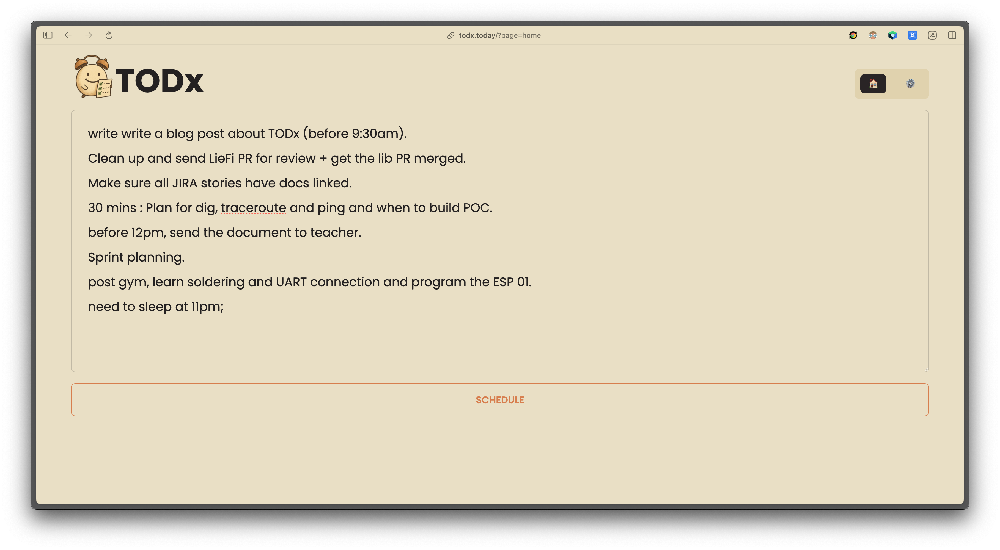
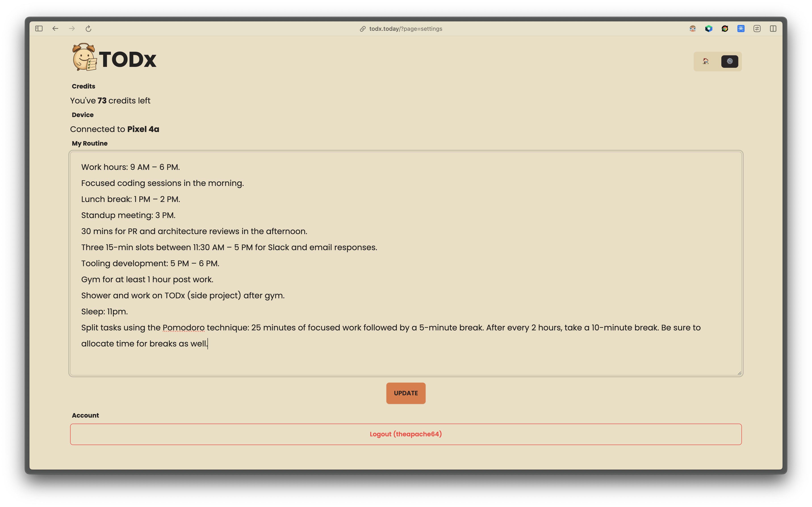
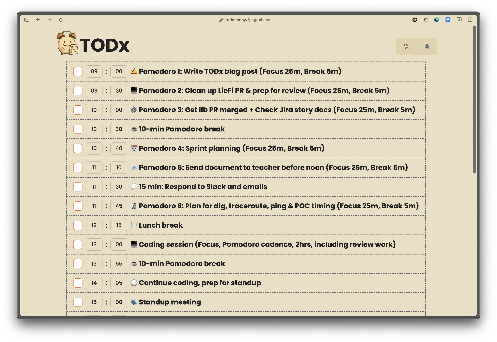
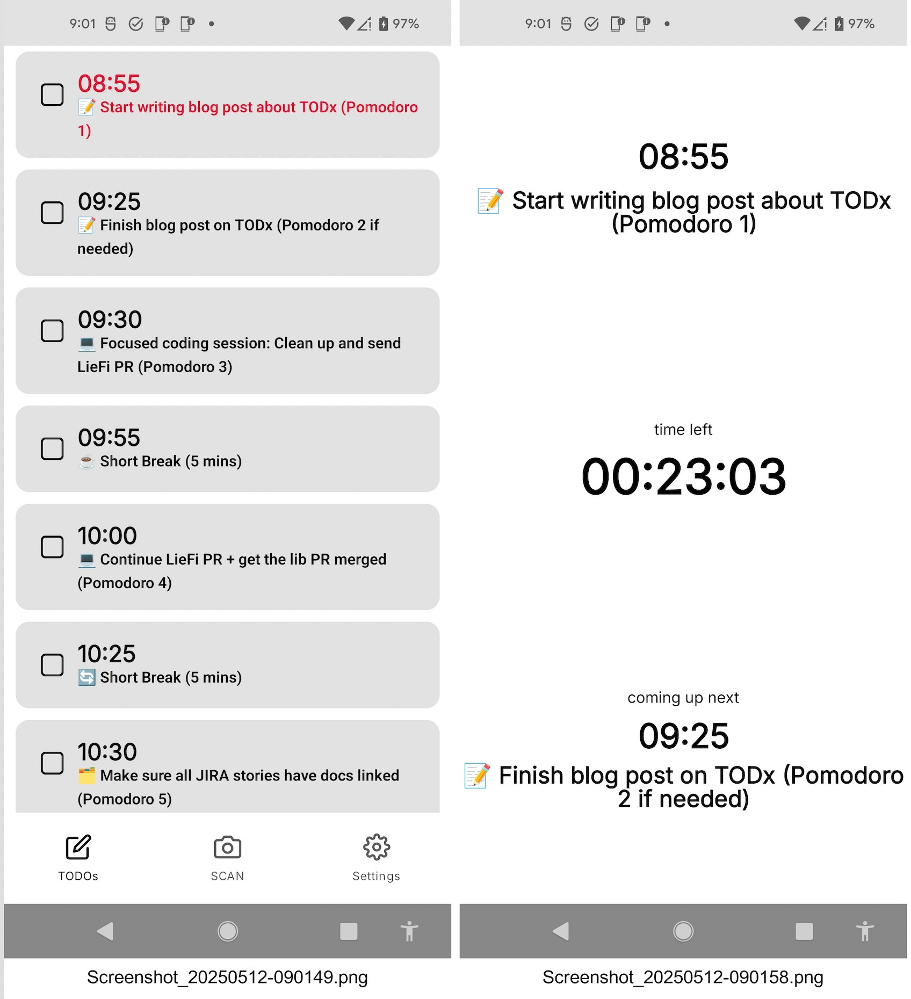

I've a personal itch. TODO apps or TODO lists. They are boring and don't work well for me.

I plan a productive day schedule, and then a bunch of new ad hoc tasks come in, or I get into the rabbit hole of messages, meetings, and emails and forget my day plan and list and only realise it after the derail. Also, in the rush of chasing a productive day, I don't schedule necessary breaks and end up burned out by the end of the day. When scheduling the day, usual TODO apps need proper time, and it's a boring, time-consuming task to set start and end times for all these things. So I built a tiny tool for me to schedule a day plan for me and I call it TODx.

## What makes TODx different?

### Just tell it what I want to do

No complex interfaces - just say what I need to get done in **raw** format.

### It knows my routine

It knows what my typical day looks like and schedule accordingly. I don't have to repeat my routine each time.

### Smart break scheduling

It can automatically fill in breaks slots using techniques like Pomodoro to keep me fresh.

### Built-in alerts and timers

The Android app sends notifications and timers so I never miss a task or break.

### It scans your handwritten TODOs

Sometimes I prefer just writing things on paper and it can scan and work the same way

## How it works?

- **Backend** : Ktor, Postgres (via Exposed), **OpenAI APIs**
- **Web App** : Compose Html and DaisyUI v4
- **Android App** : Jetpack Compose (KMP, ie Portable to iOS if there's enough interest)

## My experience

I've been using TODx for several days now, constantly improving it based on my own usage. I am still tuning the tool and fixing bugs to make it work seamlessly with my life.

## Want to try it?

You can go to https://todx.today and play with it, but for the Android app, which is necessary to get alerts, I'll have to add you to the closed beta. If you want to try the Android app, please add your email to this form -> https://forms.gle/3fAVaqkLNPUsjXB28, and I'll add you to the closed beta 🙌🏼
