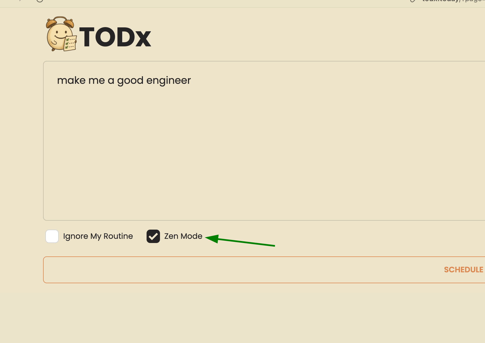

i have a personal itch: todo apps and todo lists are boring and don't work for me.  
i plan a productive day, but new ad hoc tasks come in or i get lost in messages, meetings, and emails, forgetting my plan until it's too late.  
in the rush for productivity, i also forget to schedule necessary breaks and end up burned out.  
most todo apps need precise time entries, making planning a boring and time-consuming task.  
so i built a tiny tool to schedule my day, and i call it TODx.

## What makes TODx different?

### Just tell it what you want to do

no complex interfaces.  
just tell it what needs to be done in raw format.

### It knows your routine

it knows what your typical day looks like and schedules accordingly.  
you don't have to repeat your routine each time.

### Smart break scheduling

it can automatically fill break slots using techniques like pomodoro to keep you fresh.

### Zen Mode

zen mode automatically fixes your vague/chaotic or overwhelming burnout plan.

### Built-in alerts and timers

the android app sends notifications and timers.  
you never miss a task or break.

### It scans your handwritten TODOs

sometimes people prefer writing things on paper.
these can be scanned and used in the same way.

## How it works?

- **Backend** : Ktor, Postgres (via Exposed), **OpenAI/Gemini APIs**
- **Web App** : Compose Html and DaisyUI v4
- **Android App** : Jetpack Compose (KMP, ie Portable to iOS if there's enough interest)

## My experience

i've been using todx for several days and constantly improving it based on my usage.
i am still tuning the tool and fixing bugs to make it work seamlessly for me.

## Want to try it?

you can go to https://todx.today and try it 🙌🏼
