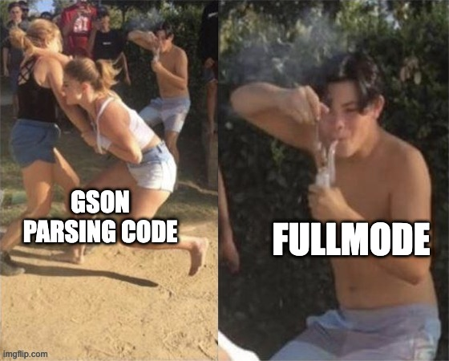
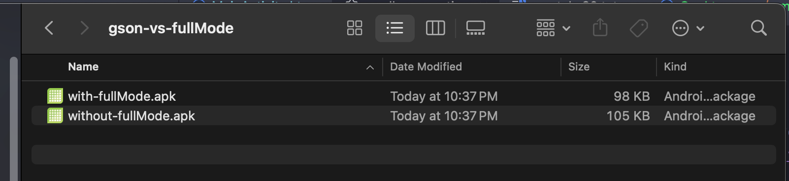
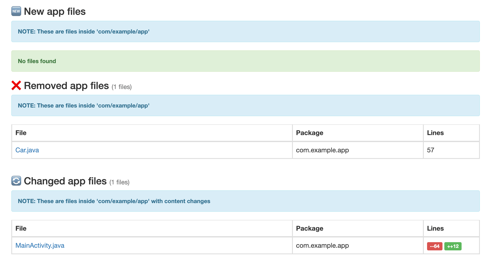
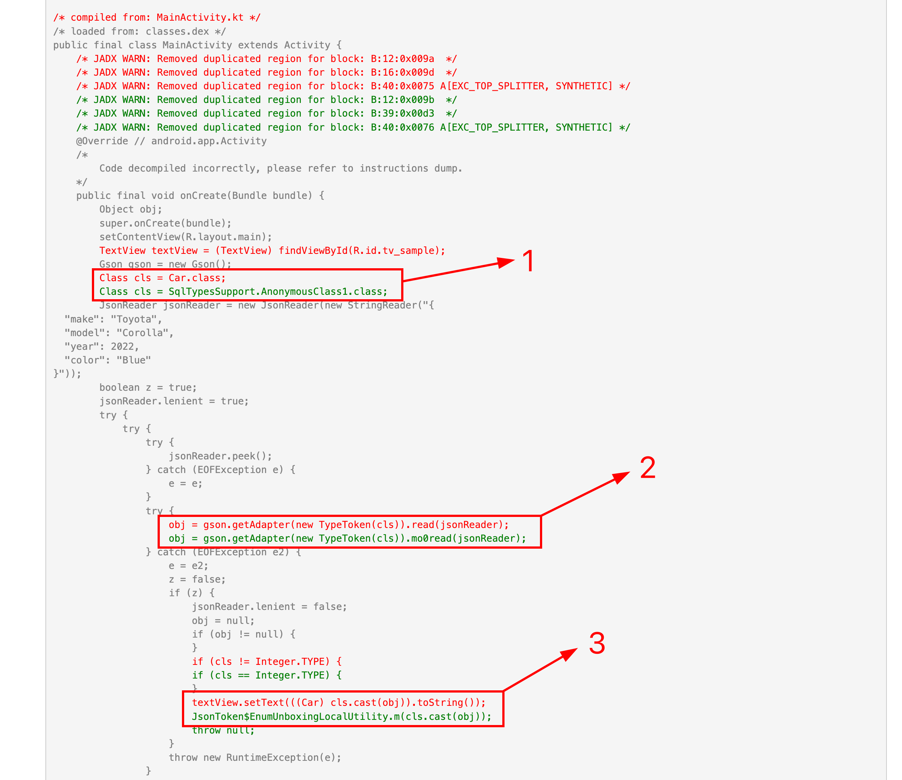
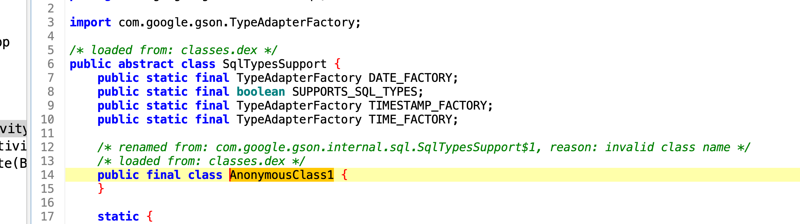
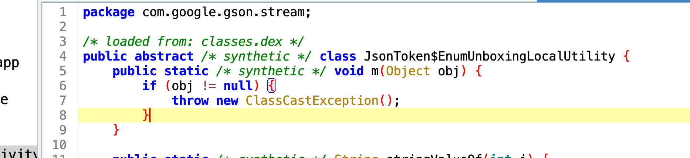
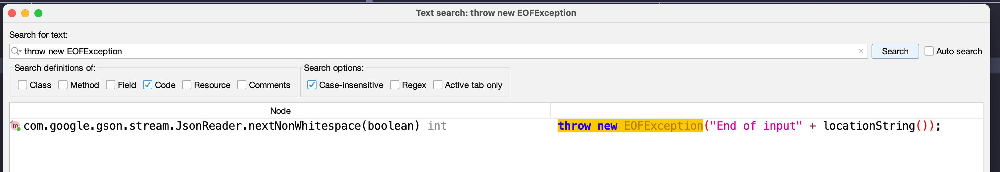
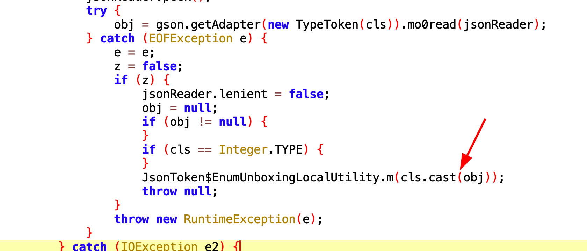

## 🙏 Disclaimer

Am starting to write this blog with a curious mind to understand why Gson started crashing after `fullMode` is enabled in a working `release` build. I can guess it could be because of Gson's reflection usage and somehow `fullMode` modified or removed something, but let's understand what's the exact change. This analysis is not about <i>"adding an extra rule should fix it"</i>. Its more about "</i>how an app which is running fine with `fullMode = false` breaks when `fullMode` set to `true`</i>

## 📗 Context

A little bit of context if you're hearing `fullMode` or `r8` for the first time.

**What's r8?**

R8 is a tool that shrinks, optimizes, and secures Android applications and libraries:
Shrinking: R8 removes unused classes, members, and resources to reduce the size of your app.
Optimizing: R8 rewrites code to improve performance.

**What's fullMode?**

fullMode, also known as non-compat mode, is a feature in Android that allows R8 to perform more aggressive optimizations. This can help reduce the size of an app's APK and improve its performance. fullMode is enabled by default from AGP 8 onwards

> <i>Source: Google</i>

## 🧨 Reproducing the crash

First step of any analysis is reproducing the issue. Let's do that.

Here's a model called `Car`

```kotlin
package com.example.app

import com.google.gson.annotations.SerializedName

data class Car(
    @SerializedName("color")
    val color: String, // Blue
    @SerializedName("make")
    val make: String, // Toyota
    @SerializedName("model")
    val model: String, // Corolla
    @SerializedName("year")
    val year: Int, // 2022
)
```

and then activity where we convert our `JSON` to `Car` model

```kotlin
package com.example.app

class MainActivity : Activity() {

    override fun onCreate(savedInstanceState: Bundle?) {
        super.onCreate(savedInstanceState)
        setContentView(R.layout.main)

        val inputJson = """
            {
              "make": "Toyota",
              "model": "Corolla",
              "year": 2022,
              "color": "Blue"
            }
        """.trimIndent()

        val tvSample = findViewById<TextView>(R.id.tv_sample)
        tvSample.text = Gson().fromJson(inputJson, Car::class.java).toString()

    }
}
```

and my proguard rules have rules mentioned in the Gson example [here](https://github.com/google/gson/blob/main/examples/android-proguard-example/proguard.cfg) except rules for the model `Car.kt` class. Now you may ask "that's clearly the problem! why don't you add it?". You're right. Adding model-specific rules will fix this, but as I mentioned above, this is about "why" it works without `fullMode` and crashes with `fullMode` 🤔, where obfuscation is enabled in both builds. This blog is just about that.

## 🎭 Behaviour

Alrighty, let's go!

As you can see in the `MainActivity`, we're parsing the `JSON` using `Gson#fromJson` and setting the `toString()` value of `data class` to a `TextView` (yeah, XML :P). Simple.

The `release` build with `fullMode = false` works fine


but, the app crashes when i run the `release` build with `fullMode = true`.
Repro success 💥

The stacktrace looks like this (minified)

```
FATAL EXCEPTION: main
Process: com.example.app, PID: 27357
  java.lang.RuntimeException: Unable to start activity ComponentInfo{com.example.app/com.example.app.MainActivity}: java.lang.ClassCastException
    ...
  Caused by: java.lang.ClassCastException
    at com.google.gson.stream.JsonToken$EnumUnboxingLocalUtility.m(SourceFile:1)
    at com.example.app.MainActivity.onCreate(SourceFile:218)
    ...
```

The above stacktrace says the crash happened due to a `ClassCastException` but that usually happens when you try to cast to a wrong class. Here, we have only one model class, and that too parsed with `Car::class.java`. Its not even "dynamic or generic"

## 👬 Compare

To clearly understand what exactly happened, we need to compare the two APKs: one with fullMode and one without fullMode. Luckily, I have a tiny tool created, called [dex-diff](https://github.com/theapache64/dex-diff) to do just that (this is not a promotion... I'd use another tool if there's a better one out there... oops, did I promote the tool again 🙊??).

Anyway, moving on, I've `dex-diff` already installed and also both APKs generated



Now I need to pass these two APKs to `dex-diff` and ask it to generate the diff. To do that, i need to execute this command

```
dex-diff without-fullMode.apk with-fullMode.apk com.example.app
```

After executing the command `dex-diff` will start decompile and diff for each class and will generate a `html` report.

```
⚔️ dex-diff v0.1.4
🧠 Heap size: 16384 MB
🚀 Initialising...
➡️ Decompiling APKs... (this may take some time)
✅ Decompile finished (7.61s)
➡️ Comparing before and after... (this may take some time)
✅ Comparing finished (0.24s)
➡️ Making report...
✅ Report ready (7.98s) -> report.html
```

Cool. The report is ready. Let's look at it

## 📜 Report



As you can see in the "Removed app files" section, our `Car` class got completely removed, and it looks like `MainActivity.java` has had `64` lines removed and `12` lines added. Let's see what happened there...

## 🤷‍♂️ Analysis : How it crashed?



So many interesting things happened in there, but there have been three major changes related to the crash where we're focusing at the moment.

1. The `Car.class` is now `SqlTypesSupport.AnonymousClass1.class` 😮
2. Previously used `.read(jsonReader)` became `.mo0read(jsonReader)` 🤔
3. There's no `TextView` and `TextView#setText` call in `MainActivity` and the area has been replaced with `JsonToken$EnumUnboxingLocalUtility.m(cls.cast(obj));` 😕

Wait, is that the crash point for our crash.. `JsonToken$EnumUnboxingLocalUtility` 🤔.. yeah it is 🫠. So that means, failed at `2` and it went to the `catch` block and crashed at spot `3`.

## 📦 What's inside?

Let's see what's inside `SqlTypesSupport.AnonymousClass1.class`?

(To browse the decompiled code better, I'll be using `jadx`)



Wow! Its an empty class! and what's inside `JsonToken$EnumUnboxingLocalUtility`



Alright. Now the crash makes sense. I'll tell you how it crashed.

1. At block 1, `cls` gets assigned to an empty class.
2. At block 2, the empty class tries to get converted to an object (parsing). It fails, and the `EOFException` gets thrown from the Gson library.



3. Because the parsing failed, the `obj` stays `null` and `cls.cast(obj)` throws `ClassCastException`. Because it was casting to `null`, and that's why stack trace does not indicate which cast "to" failed. And this exception caused the app to crash.



## 🕵️ Analysis : Why it crashed?

Ultimately, the crash happened because `Car` class got replaced with an empty class called `SqlTypesSupport.AnonymousClass1`.

**Why `Car` class got removed?**

Because `Gson` uses reflection to create your model class, and not the class's constructor. `fullMode` couldn't find any constructor usage and it probably thought "<i>`Car` constructor is not getting invoked, that means `Car` class objects are not getting created, that means Car class properties are not getting created, so since `Car.class` code is there, let's replace the usage with an empty class that's already present in the code, i.e., `SqlTypesSupport.AnonymousClass1`"</i>.

To validate this theory, I created another `Car` object manually in `MainActivity`, and the app didn't crash

> NOTE: This is my best guess from the decompiled APK code. CMIIW

## ❤️‍🩹 How to fix it?

Fixing is simple. You just need to add the `Car` to your ProGuard rules, but a better fix would be to stop using `Gson` and migrate to a JSON library that doesn't use reflection for parsing, like [Moshi CodeGen](https://github.com/square/moshi?tab=readme-ov-file#codegen) (not `moshi-reflect`) or [Kotlinx.serialisation](https://github.com/Kotlin/kotlinx.serialization)

## 🤝 Thanks

Oh, wow. You made it to the end. That means I probably didn't bore you or make you more confused. If that's not the case, please use the box below to share that. I'd be happy to take the feedback and reflect in the next blog. Thanks for reading
