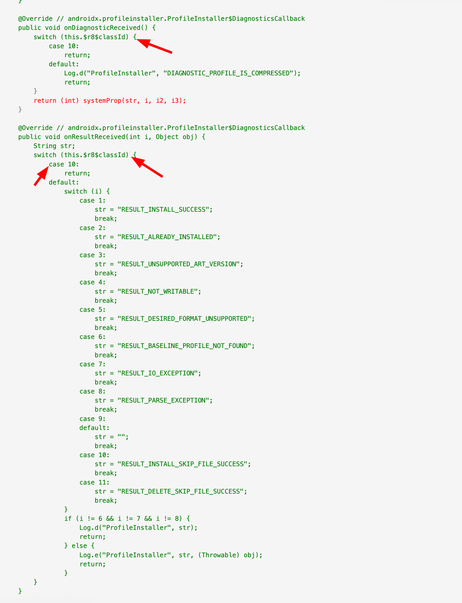

> Disclaimer : This is not a typical blog with a conclusion, rather, this blog is more like a journey where I walk you through how to decompile APK and understand a sample of what fullMode do to your APKs.


## 🙏 Introduction

Few days back I posted this tweet in X


and this was the result


I don't want to keep you in suspense. The correct answer is `Audi: BMW@...`. That means 35.4% of people got it wrong and 47.9% of people got confused about the output. That's a really big number and that's the inspiration to write this blog and analyse "why" R8 preferred BMW over Audi

## 📗 Context

A little bit of context if you're hearing `fullMode` or `r8` for the first time.

**What's r8?**

R8 is a tool that shrinks, optimizes, and secures Android applications and libraries:
Shrinking: R8 removes unused classes, members, and resources to reduce the size of your app.
Optimizing: R8 rewrites code to improve performance.

**What's fullMode?**

fullMode, also known as non-compat mode, is a feature in Android that allows R8 to perform more aggressive optimizations. This can help reduce the size of an app's APK and improve its performance. fullMode is enabled by default from AGP 8 onwards

> <i>Source: Google</i>

## 👨‍💻 Code

<i>Talk is cheap. Show me the code!</i>

```kotlin
class Audi(val name: String, val year: Int)
class BMW(val name: String, val year: Int )

class MainActivity : ComponentActivity() {

    override fun onCreate(savedInstanceState: Bundle?) {
        super.onCreate(savedInstanceState)

        println("BMW: ${BMW("X3", 2024)}")
        println("Audi: ${Audi("Q3", 2024)}")
    }
}
```

- Two classes
- Different names but similar dataTypes; 1 `String` and 1 `Int`

## ▶︎ Run

Let's run this and see what happens. Please note that we're using AGP 8+, hence `fullMode` is enabled by default.

**Debug mode**

```
BMW: BMW@1b51a2
Audi: Audi@3cd4e33
```

Everything looks good ✅

**Release mode**

```
BMW: BMW@a8d4f97
Audi: BMW@2351584
```

Wow, why am I getting only BMW? What happened to my Audi? What did `fullMode` do to my Audi? 🤔

## 📊 Comparison

To clearly understand what exactly happened, we need to compare the two APKs: one with fullMode and one without fullMode. Luckily, I have a tiny tool created, called [dex-diff](https://github.com/theapache64/dex-diff) to do just that (this is not a promotion... I'd use another tool if there's a better one out there... oops, did I promote the tool again 🙊).

Anyway, moving on, I've `dex-diff` already installed and also both APKs generated


Now I need to pass these two APKs to `dex-diff` and ask it to generate the diff. To do that, i need to execute this command

```
dex-diff without-fullMode.apk with-fullMode.apk com.example.app
```

After executing the command `dex-diff` will start decompile and diff for each class and will generate a `html` report.

```
⚔️ dex-diff v0.1.4
🚀 Initialising...
➡️ Decompiling APKs... (this may take some time)
✅ Decompile finished (10.34s)
➡️ Comparing before and after... (this may take some time)
✅ Comparing finished (1.12s)
➡️ Making report...
✅ Report ready (11.66s) -> report.html
```

Let's look at the report file


There's my `Audi` in the removed files list :(, but why `Audi` and why not `BMW`? My best guess is, its the no of characters (CMIIW).

```
BMW - 3 chars
Audi - 4 chars
```

Now let's see what happened at `MainActivity` side, and why its printing `BMW` always.


Looks like,

- without `fullMode`, instead of using the corresponding class,
  r8 used the `Object` class. This makes sense as I was not using the properties of the class (`name :String and year : Int`) but after
- `fullMode` is enabled, its now started using a proper class, but it started using the `BMW` class for both `Audi` and `BMW`

This possibly happened because `Audi` and `BMW` had same structure and r8 decided to save some memory by removing one of them. (I'd like to modify the structure of the class and play with it to see what happens, but maybe that's for Part 2? Let's focus on this particular example for now - comment below if you'd like to see that pls)

and if you look closely, you'll see `BMW` now accepts an `Int`, and we're passing `0` and `14`


What are these integers? What are they doing inside the `BMW` class? By the way, what's the current situation of the `BMW` class? Let's check that.


Oh my god! `BMW` is not `BMW` right now. To me, it looks more like this


but what was that `0` and `14`. For now let's just calm down and check that (focus...focus...)


The class surprisingly doesn't have a case checking for `0` and `14`, hence it will fallback to the `super.toString()` method in this particular case. However, why was an integer passed here then? What lies between `0` and `14`?



Looks like the `Int` that was passed will be used to define the behavior of the call to each method. Wow, now I know why they call it an "aggressive" optimization.

## 📖 Major Learnings

When `fullMode` is enabled,

- Don't play with reflection APIs or don't play with class name and structures (eg: `MyClass::java.class.simpleName` won't neccesarly print `MyClass`)
- Use proguard rules if there's a class depends on reflection. (eg: Gson models)

## 🤝 Thanks

Thanks for reading! If you'd like me to dive deeper into the topic or continue with a part two, let me know. I'm not a regular blogger, so if you found this post helpful or interesting or it didn’t hit the mark, I'd love your feedback for that as well in the comments 👇
